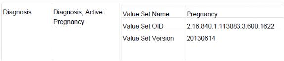
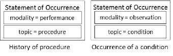
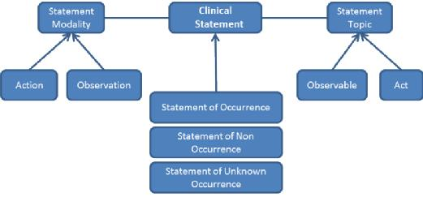
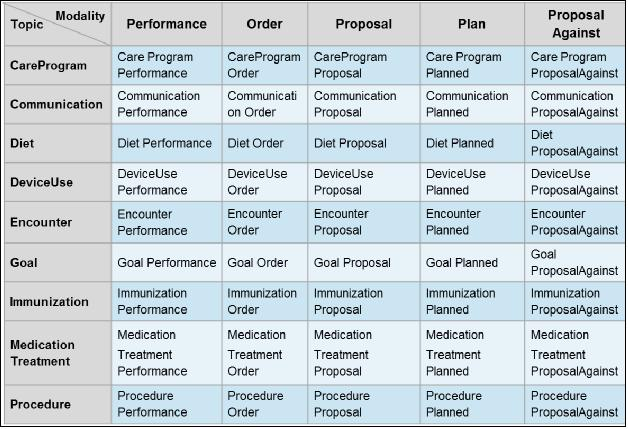
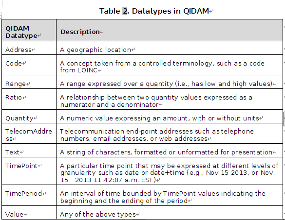

# HL7 Domain Analysis Model: Health Quality Improvement, Release 1 September 2014 US Realm Informative Specification文档        9/16/14

##  Introduction简介
目前在美国，电子化的医疗质量测度eCQM和临床决策支持CDS是采用不同的数据模型来表达的。eCQM用的是QDM(Quality Data Model质量数据模型)，CDS是使用vMR(Virtual Medical Record虚拟病历)。而二者之间又存在紧密的关联，eCQM度量医疗服务的质量，CDS为改进以来质量通过干预措施，二者存在共通的需求，即如何标识某种eCQM或CDS知识/规则所应用的患者。
举例说明，在CDS中常常会用到怀孕的概念，我们可以将其映射到eCQM目前所使用的vMR模型中，在vMR中 如果Problem中给类的problemCode使用了特殊的字典(2.16.840.1.113883.3.600.1622 怀孕)，我们就认为这个Pbolem类它表示的是怀孕的概念。如下所示：
```
<def name="Pregnancy">
    <expression xsi:type="ClinicalRequest" cardinality="Multiple"
        dataType="vmr:Problem" codeProperty="problemCode"   
       dateProperty="problemEffectiveTime.low"
         useValueSets="true" subjectProperty="evaluatedPersonId">
        <codes xsi:type="ValueSet" id="2.16.840.1.113883.3.600.1622"
            authority="Quality Insights of Pennsylvania" 
                version="20130614" />
    </expression>
</def>
```
反过来 我们也可以用QDM(eCQM)模型来表达vMR(CDS)中的概念，比如eCQM中使用“Diagnosis, Active: Pregnancy” 的术语来表示怀孕，对于CDS而言，我们可以用字典为(2.16.840.1.113883.3.600.1622 怀孕)的Diagnosis类同样来表示怀孕。


##  目标
这份文档也就是QIDAM(Health Quality Improvement Domain Analysis Model 医疗质量改进领域分析模型)是一个概念层面数据模型(其实应该是概念模型就对了)，可以作为这个域的任何一种逻辑数据模型的基础。
这个模型分析了逻辑数据模型的需求，也就是说应该包含哪些元素。这个逻辑数据模型是用来表达医疗质量改进领域知识中的逻辑条件、总体条件、公式和其他表达的临床数据模型。这样子就确保了CDS和eCQM知识之间的一致性。

## 受众
包括医疗知识质量的测度、管理和上报的工作人员，知识的编辑和使用人员，标准分析和开发人员，工具开发人员以及系统集成商。
最好熟悉OO的设计原则和UML知识。
## 大背景介绍
MU第二阶段中要求通过认证的EHR系统实现CDS来支撑eCQM的改进。eCQM和CDS知识采用了不同的数据模型则1)阻碍了二者之间患者数据需求的共享;2)要求软件供应商在不同的格式间进行映射3)阻碍了二者之间共享模块开发
vMR是HL7的一种逻辑模型，2014年发布了第二版。使用UML来定义，其中的概念沿用了HL7 CLinical Statement 模型中的概念，使用了简化版的HL7 V3数据类型第二版。该模型的核心类是ClinicalStatement，该类可以具体化成ProcedureEvent，其中也包含了proposals的类，用以表示医嘱套餐中的一项或者一些规则中的建议。
QDM模型是基于components的，规定了如何将这些components组合成一种数据映射的表达方式。其中包括了：
*  Category (e.g., Procedure, Medication, Communication)
*  State (e.g., Active, Administered)
*   Attribute (e.g., Dosage, Frequency, Admission Date Time)
*  Timing Operators (e.g., Starts Before or During)
QIDAM对两种模型进行了整合

## 方法学
QIDAM旨在确定医疗质量改进的应用程序的数据需求，它整合了vMR和QDM的功能点。除此之外，还考虑了Quality Reporting Document Architecture (QRDA) Category 1 Templates 、vMR Templates 、Consolidated Clinical Document Architecture (CCDA) Templates 中的模板来分析QIDAM中要对哪些概念建模，概念的结构。另外还尽可能的复用了HL7 Fast Healthcare Interoperability Resources (FHIR) Specification 和Federal Health Information Model (FHIM) Specification 的元素。
附件中的QDM-vMR-cross-map.xlsx中提供了QIDAM、QDM、VMR之间的映射关系。
由于QIDAM是概念模型，使用VMR和QDM表达的数据完全没必要转换成QIDAM。你可以通过将自己的数据模型与QIDAM映射的方式来分析数据模型是否有能力提供实现医疗质量改进目标所需的数据。

## 范围      
仅适用于US的eCQM和CDS制品中所需的临床数据元的表达。目前涵盖的概念包括：
*   Communication
*   Care goals
*   Diet and nutrition
*   Participation in care plans and protocols
*   Use of devices
*   Encounters
*   Immunization
*   Medication treatments
*   Procedures
*   Allergies, intolerances, and adverse reactions
*   Conditions including findings, diagnoses, symptoms
*   Contraindications
*   Care experience 
*   Family history
*   Observation results 
*   Predictions such as risks and prognoses


## 场景分析
能够使用到  QIDAM的场景有三：
* artifacts的开发
    *  描述：eCQM和CDS artifacts的作者创建数据标准或动作/行为标准
    * 标识符：M1
    *  角色：eCQM author or CDS artifact author
    *  前置条件：数据标准以描述性的形式(指南中或指标中的文字)已经有了；对于CDS而言，建议或其他动作的标准以描述性的形式存在(临床指南中的文本 检查或处方)
    * 动作：作者确定了选取哪个QIDAM概念来表示数据标准或动作/行为标准;作者确定了数据标准或动作/行为标准的语境，使用语境来选择QIDAM中的概念类;作者确定具体的属性，使用QIDAM属性来完成数据或行为标准
    * 后置条件：通过QIDAM就可以实现完整准确的数据标准或动作/行为标准的定义，标准中会包含一些诸如剂量、时间，字典中的属性来表达数据元(如诊断、用药、手术)
    * 备注：如果QIDAM用到了一些属性，它们的值来自其他受控术语中编码值，QIDAM中并未对编码进行限制
* artifacts的实现
    * 描述：eCQM和CDS artifact实现人员将采用QIDAM定义的数据标准和动作/行为标准对应到自己系统中
    * 标识：M2
    *  角色：eCQM implementer or CDS artifact implementer
    * 前置条件：eCQM  or CDS artifact 中已经定义好了数据标准，数据标准中将artifact中的用到的标记或名称映射到QIDAM中的定义 比如Last LDL result到an observation result with the specified LOINC codes and date selection criteria;
     CDS artifact 包含了行为/动作标准(prescription of statins)
    * 动作：实施人员确定与用QIDAM定义的数据标准或动作标准中等同的目标系统中的元素 一张表或一个类;实施人员使用这个定义在目标环境下来构建数据或动作的定义;如果QIDAM的元素属性存在不明确的地方，实施人员对模型标准文档进行咨询; 重复此任务    
    * 后置条件：实施人员成功的将eCQM和CDS制品中的数据标准、动作行为标准全部映射到自己的系统当中。
    *  备注：如果数据标准、动作行为标准中的一些项在目标系统中找不到对应的元素，根据实际情况可以不处理
* artifacts的评估
    *  描述：指标评估系统或者CDS系统来评估eCQM或者是CDS。用QIDAM来表示数据标准、动作/行为标准
    *  标识符：M3
    * 角色：A measure calculation system or a CDS system 
    *  前置条件：eCQM CDS制品中存在数据标准，数据标准将制品中的符合映射到QIDAM的定义中;
    CDS制品包含了行为动作标准；
    制品中的所有标准都已经映射到自己系统的数据模型中或者是系统可以执行的动作
    * 动作：系统评估CDS制品和eCQM;当系统遇到数据标准，能够将其无歧义的转换成一个检索/查询数据的请求;CDS系统可以决定应用某个行为标准是由于评估逻辑，系统将标准转换成可执行的动作;动作分两种，一种是展现给用户的proposal，一种是系统自动执行的;
    *  后置条件：eCQM评估的结果是可计算机化的质量指标的效果，CDS制品评估的结果是从动作集合中选一个或者执行一些动作
    * 备注

artifacts在HL7中用的很多，比如像每个域对应的类图、excel、xsd等等，这里我们就理解成CDS的知识/规则。
这里我们描述时是将QIDAM作为数据模型来使用的，实际应用中，我们只需要用我们自己的数据模型将其替换即可。

## 模型概述
### 设计
#### 方法学
在QIDAM中，表达患者数据的核心概念是ClinicalStatement类。这个类又将ClinicalStatement分成三大类：
*  StatementOfOccurrence:表示一个事件的发生(肺炎)或者与患者健康相关的动作(用药)
*  StatementOfNonOccurrence：表示某个类型的事件或动作并没有发生
*  StatementOfUnknownOccurrence：表示不知道某个类型的事件或动作有没有发生
每种类型的statements都包含元数据，主题和模式 如下图，
主题 topic指的是该statement的主题如症状、检验结果、手术或免疫接种;模式指的是主题发生、存在或进行的方式，如观察、医嘱、治疗计划;患者诊断可以用StatementOfOccurrence(topic是condition，modality是observation)，手术史可以用StatementOfOccurrence(topic是procedure，modality是performance) 主题和模式都是类，可以通过用属性来进一步描述。

目前主题有两类：见   
* Act：用以评估或改变患者健康的已经发生的事-比如药物治疗，血压测量，胸部X射线检查
* Observable:构成患者健康状态的元素-通常是检查、检验的结果，既往病情、现病情，检验结果，生命体征，过敏，预后
模式modality也包含两大类：
* Action:临床声明中的act存在的模式，可以有子类型，包括医嘱、order 和执行performance。如果StatementOfOccurrence(topic是procedure，modality是order )指的是手术医嘱。如果StatementOfOccurrence(topic是procedure，modality是peformance )指的是已执行或即将执行的手术
* Observation：临床声明中的observable存在的模式。不存在子类型

topic和modality要匹配，如果topic是observable，modality必须是observation 如下图所示：
     
如果topic是Act，modality必须是Performance,Proposal,proposalAgainst,Order,Plan

1.有关action的临床声明
如果topic是Act类型(参考5.1.1 共有14种),modality是Action类型
a CDS system offers a proposal for an MRI exam; the acceptance of the proposal leads to an order for the exam; an appointment is scheduled; and finally the exam is performed at the scheduled time. However, this sequence does not necessarily have to get followed. In fact, providers write orders without a prompt by a CDS system, many orders are fulfilled without an explicit plan being created, and many acts do not require orders if it is within the scope of the responsibility of the person carrying out the action (e.g., a physician counseling the patient on smoking cessation will not write an order, even though a CDS system may propose doing so and a quality measurement system expects a statement reflecting that such counseling was performed)

2.有关observation的临床声明
如果topic是Observable类型(参考5.4 共有19种),modality是Observation类型(只此一种)
3.设计原理
QIDAM利用继承 组合来构建模型元素.这种方法很适合来构建一些易于读写的表达式的结构,允许对模型进行扩展,同时保持了模型内部的一致性.
患者相关的数据可以视作ClinicalStatement的子类,只有当ClinicalStatement直接包含了声明相关的属性如作者\对象\时间等,modality和topic针对的是临床内容(待执行的手术操作,手术的部位),对于某个具体的声明而言,只需要将相应的modality和topic组合在一起就好.这样就实现了它们的复用,保持了模型的一致性.所有有关order医嘱的声明都有一个叫order的属性,因为它们都用到了同一个Order modality.

Action 和Observable 的子类型都会有自己特殊的字段/属性,
QIDAM将不同的临床声明分为已经发生的,未发生的,不知道有没有发生的动作或观察.在其他很多地方,比如HL7 RIM模型中是通过一个否定标记来实现的.以此避免推理时出错.
每种类型的statements都包含元数据，主题和模式
#### 数据类型、实体和扩展数据类型
定义了如下高级的数据类型 可以进一步细化

#### 基数和可选性
QIDAM中基数能够表达元素的出现次数,但可选性则表达不了.遵循如下原则:
单一基数,图中不出现
多基数图中表示为0..*
这里的0不应该理解成是该元素的可选性.
#### 质量改进的逻辑模型
逻辑模型用来表达指标\规则\医嘱套餐中等中的表达式,条件等.
    * 详细描述了某个临床声明如何组合得到,声明的属性如何在表达式中获取/访问
    * 给已有的类添加一些属性 比如说id
    * 确定数据类型,实体.扩展数据类型
    * 确定属性的基数和可选性
    * 确定逻辑模型的扩展机制
    *确定需要哪些类 那些属性才能映射到诸如FHIR这些模型中以实现互操作性

## 实例           

  | 源文档标识 | 原始表达式 | QIDAM表达式 |     
  | ----- | ----- | ------ |     
  | NQF 0068 | Procedure, Performed: Percutaneous Coronary Interventions&lt;= 12 month(s) ends before start of "Measurement Period"using "Percutaneous Coronary Interventions Grouping Value Set (2.16.840.1.113883.3.464.1003.104.12.1010) | StatementOfOccurrence withtopic Procedure- procedureCode in PCI Grouping VSmodality Performance- performanceTime ends &lt;= 12 months before start of "Measurement period" |     
  | NQF 0068 | Medication, Active: Aspirin and Other Anti-thrombotics" ends before start of "Measurement Period | StatementOfOccurrence withtopic MedicationTreatment- medication in ASA+AT Grouping VSmodality Performance- performanceTime ends &lt;= start of "Measurement period"-actionPerformed = MedicationRegimen |     
  | NQF 0440 | Encounter, Performed: Non-Elective Inpatient Encounter (admission datetime)" &lt;= 1 hour(s) starts after end of "Occurrence A of Encounter, Performed: Emergency Department Visit (facility location departure datetime)" | StatementOfOccurrence withtopic Encounter-serviceType in Non-Elective Inpatient Encounter VSmodality Performance-performanceTime begins &lt;=1 hour after end of "Encounter, Performed: Emergency Department Visit" |     
  | NQF 0002 | "Laboratory Test, Result: Group A Streptococcus Test (result)" &lt;= 3 day(s) starts before or during "Occurrence A of Encounter, Performed: Ambulatory/ED Visit" | StatementOfOccurrence withtopic MicrobiologySensitivityResult-name in Group A Streptococcus Test VSmodality Observation-observedAtTime  &lt;=3 days before "Encounter, Performed: Ambulatory/ED visit" |     
  | NQF 0565 | "Physical Exam, Finding: Best Corrected Visual Acuity (result: 'Visual acuity 20/40 or Better')" &lt;= 90 day(s) starts after end of "Occurrence A of Procedure, Performed: Cataract Surgery" | StatementOfOccurrence withtopic SimpleObservationResult-name in Best Corrected Visual Acuity VS-value &gt; code for Visual acuity 20/40modality Observation -observedAtTime &lt;=90 days after" Procedure, performed: Cataract surgery" |     
  | NQF 0018 | "Physical Exam, Finding: Systolic Blood Pressure (result &lt; 140 mmHg)"during MOST RECENT: "Encounter, Performed: Office Visit" | StatementOfOccurrence withtopic SimpleObservationResult- name in Systolic BP VS- value &lt; 140 mm Hgmodality Observation - observedAtTime within (mostRecentOfficeVisitEnc.performanceTime) |     
  | NQF 0059 | Laboratory Test, Result: HbA1c Laboratory Test" during "Measurement Period"AND: "Occurrence A of Laboratory Test, Result: HbA1c Laboratory Test (result &gt; 9 %)" | StatementOfOccurrence withtopic SimpleObservationResult-name in HbA1c Laboratory Test in-value &gt; 9%modality Observation -observedAtTime within measurement period |     
  | NQF 1659 | "Procedure, Performed not done: Drug not available" during "Occurrence A of Encounter, Performed: Encounter Inpatient"  | StatementOfNonOccurrence withtopic Procedure-currentStatus = {  -reason=“Drug not available”}modality Performance-occurredDuring = "Encounter, Performed: Encounter Inpatient |     
  | NQF 528 | "Medication, Administered: Hospital measures-IV Vancomycin (route: "Hospital measures-Route IV")" &lt;=1440 minutes(s) starts before start of "Occurrence A of Procedure, Performed: Hospital measures-Joint Commission evidence of a surgical procedure requiring general or neuraxial anesthesia (incision datetime)"  | StatementOfOccurrence withtopic MedicationTreatment-medication in IV Vancomycin VS-dosage {deliveryRoute in Hospital measures-Route IV VS}modality Performance-performanceTime.begin&lt;=1440 minute(s) before (Procedure, Performed: Hospital measures-Joint commission evidence of a surgical procedure requiring general or neuraxial anesthesia" - performanceTime.begin)-actionPerformed: DoseAdministration |              
  | https://www.icsi.org/_asset/dwy1nl/ACSOS1112.doc | Glucose by finger stick screening 4 times daily (before meals and at bedtime) for 24 hours | StatementOfOccurrence withtopic Procedure-procedureCode in Glucose Measurement by Finger stick screening VS-procedureSchedule=4 times daily (before meals and at bedtime) for 24 hrsmodality Proposal |                      
  | https://www.icsi.org/_asset/dwy1nl/ACSOS1112.doc | Ticagrelor180 mg loading dose by mouth once90 mg by mouth twice daily | StatementOfOccurrence withtopic MedicationTreatment-medication in Ticagrelor VS-dosage { {  - doseType=loadingDose  - route=oral  - doseQuantity=180 mg  - schedule=Once on day 1   } {   - deliveryRoute=oral  - doseQuantity=90 mg  - administrationSchedule=twice daily starting day 2  }modality Proposal |                 
  | NQF 0070 | Medication Adverse Event to Beta Blocker Therapy. | StatementOfOccurrence withtopic AdverseReaction-exposure.stimulus in Beta Blocker VSmodality Observation |                    
  | NQF 0055 | Medication dispensed:Medications indicativeof diabetes  &lt;= 2 yearsbefore or simultaneously to“Measurement end date”. | StatementOfOccurrence withtopic MedicationTreatment- medication in medications indicative of diabetes VSmodality Performance-actionPerformed = Dispense-performanceTime &lt;=2years before or simultaneously to “measurement end date” |                
  | Corticosteroid inhaler reminder | Allergy To inhaled corticosteroids | StatementOfOccurrence withtopic AllergyIntolerance-stimulus in corticosteroids VS-sensitivityType=Allergymodality Observation |                   
  | Heart Failure Admission ToMedSurgOrderSets | Not allergic to an ACE inhibitor. | StatementOfNonOccurrence with topic AllergyIntolerance -stimulus in ACE inhibitor VS-sensitivityType=Allergy modality Observation |                      
  | CMS 147v2 | Communication from patient to provider: Previous receipt of influenza vaccine | StatementOfOccurrence with topic Communication -recipient=provider-sender=patient-relatedStatement: {StatementOfOccurrence reference for influenza vaccine admin}}modality Performance |               
  |  | Family History Of breast cancer in mother. | StatementOfOccurrence withtopic FamilyHistory-relationship=mother-condition= Breast Cancermodality Observation |                        
  | NQF0038 | "Medication administered: rubella vaccine", occurring &lt;2 years after "Patient characteristic: birth date | StatementOfOccurrence withtopic Immunization-vaccine.vaccineType in Rubella Vaccine VS modality Performance-performanceTime= &lt;2years after birth date |     
  | CMS135v1 | "Medication, Allergy: ACE inhibitor or ARB Allergen"(http://ushik.org/ViewItemDetails?&amp;system=mu&amp;itemKey=161732000&amp;enableAsynchronousLoading=true#qde_161734000) | StatementOfOccurrence withtopic AllergyIntolerance-sensitivityType=Allergy-stimulus in ACE inhibitor or ARB Allergen VS modality Observation |    
  | CMS142v1 | Communication: From Provider to Provider: Level of Severity of Retinopathy Findings(http://ushik.org/ViewItemDetails?&amp;system=mu&amp;itemKey=162036000&amp;enableAsynchronousLoading=true#qde_162048000) | StatementOfOccurrence with topic Communication-recipient=provider-sender=provider-message=“ObservationResult statement containing level of severity of retinopathy findings” modality Performance |     
  | CMS73v1 | Medication, Administered: Parenteral Anticoagulant(http://ushik.org/ViewItemDetails?&amp;system=mu&amp;itemKey=161140000&amp;enableAsynchronousLoading=true#qde_161150000) | StatementOfOccurrence with topic MedicationTreatment -medication in Parenteral Anticoagulant VS modality Performance-actionPerformed = MedicationRegimen |    
  | CMS73v1 | Laboratory Test, Result: INR (result&lt;2)(http://ushik.org/ViewItemDetails?&amp;system=mu&amp;itemKey=161140000&amp;enableAsynchronousLoading=true#qde_161145000) | StatementOfOccurrence withtopic SimpleObservationResult-value &lt;2-name in INR VSmodality Observation |            
  | USPSTF Screening for Syphilis Infection In Pregnancy | Screen for syphilis infections | StatementOfOccurrence withtopic Procedure-procedureCode in Screening Test for Syphilis Infection VS modality Proposal |                      
  | CMS135v2 | Encounter, Performed: Care Services in Long-Term Residential Facility during   Measurement Period(http://ushik.org/ViewItemDetails?&amp;system=mu&amp;itemKey=161732000&amp;enableAsynchronousLoading=true#qde_161741000) | StatementOfOccurrence withtopic Encounter-location.function=Long-Term Residential Facilitymodality Performance-performedanceTime=during Measurement Period |                
  | CMS190v1 | Device, Applied not done: Patient Refusal  for Graduated compression stockings (GCS)(https://ushik.ahrq.gov/details?itemKey=160837000&amp;System=mu&amp;enableAsynchronousLoading=true#qde_160876000) | StatementOfNonOccurrence withtopic DeviceUse-device.type in Graduated compression stockings VSmodality Performance-currentStatus.reason=patient refusal |    
  | CMS178v2 | Device, Applied: Hospital Measures-Indwelling urinary catheter (https://ushik.ahrq.gov/details?itemKey=160677000&amp;System=mu&amp;enableAsynchronousLoading=true#qde_160682000) | StatementOfOccurrence withtopic DeviceUse-device.type in Indwelling urinary catheter VS modality Performance |    
  | CMS157v1 | Occurrence A of Diagnosis, Active: Cancer(https://ushik.ahrq.gov/details?itemKey=162435000&amp;System=mu&amp;enableAsynchronousLoading=true#qde_162440000) | StatementOfOccurrence withtopic Condition-name in Active Cancer VSmodality Observation |    
  | Acute Coronary Syndrome, Admission to CCU for - https://www.icsi.org/_asset/dwy1nl/ACSOS1112.doc | Consistent carbohydrate (CHO)Diet | StatementOfOccurrence withtopic Diet-nutritionItem[OralDiet].dietType= carbohydratesmodality Proposal |     
  | USPSTF Routine Screening for Iron Deficiency Anemia in Asymptomatic Pregnant Women | recommends routine screening for iron deficiency anemia | StatementOfOccurrence withtopic Procedure-procedureCode in screening test for iron deficiency anemia VSmodality Proposal |     
  | CMS114v1 | Medication, Administered not done: Medical Contraindication" for "Injectable Factor Xa Inhibitor(https://ushik.ahrq.gov/details?itemKey=160451000&amp;System=mu&amp;enableAsynchronousLoading=true#qde_160472000) | StatementOfNonOccurrence withtopic MedicationTreatment-medication.code in Injectable Factor Xa VSmodality Performance-currentStatus.reason=MedicalContraindication |    
  | CMS157v1 | Procedure, Performed: Chemotherapy Administration(https://ushik.ahrq.gov/details?itemKey=162435000&amp;System=mu&amp;enableAsynchronousLoading=true#qde_162438000) | StatementOfOccurrence withtopic Procedure-procedureCode in Chemotherapy Administration VSmodality Performance |     
  | CMS53v1 | Diagnostic Study, Result: Hospital Measures-ECG Impression(https://ushik.ahrq.gov/details?itemKey=160997000&amp;System=mu&amp;enableAsynchronousLoading=true#qde_161014000) | StatementOfOccurrence withtopic ObservationResult-name in ECG-Impressionmodality Observation |     
  | CMS136v2 | Encounter, Performed: Discharge Services- Observation Care(https://ushik.ahrq.gov/details?itemKey=161771000&amp;System=mu&amp;enableAsynchronousLoading=true#qde_161782000) | StatementOfOccurrence withtopic Encounter-serviceType in Discharge services Observation care VSmodality Performance |     
  | HL7 V3 DAM, Diet and Nutrition Orders, DSTU Release 2 | a standard, polymeric enteral formula was selected from the hospital’s established formulary, and a total energy target of 20–25 kcal per kg actual body weight  | StatementOfOccurrence with topic Diet-nutritionItem=  {EnteralFormula with     -caloricDensity=20–25 kcal per kg     -product=standard, polymeric enteral formula  } modality Order |     
  | Stroke for Patient not Receiving tPA, Ischemic; Admission for -  https://www.icsi.org/_asset/gd1yy3/StrokeOSnontPA0712.doc | keep patient with nothing by mouth | StatementOfOccurrence with topic Diet-nutrititionItem[OralDiet].dietType=NPO code |     
  | CMS113v1 | Diagnosis, Active: Spontaneous Rupture of Membranes(https://ushik.ahrq.gov/ViewItemDetails?&amp;system=mu&amp;itemKey=160421000&amp;enableAsynchronousLoading=true#qde_160433000) | StatementOfOccurrence withtopic Condition-name in spontaneous rupture of membranes VS-conditionstatus=Activemodality Observation |     
  | QIDAM developers | Patient is not pregnant. | StatementOfNonOccurrence withtopic Condition-name in Pregnancy VS modality Observation |    
  | QIDAM developers | Unknown if patient has history of rheumatic fever | StatementOfUknownOccurrence with - topic Condition -name in Rheumatic fever VSmodality Observation |    
  | QIDAM developers | Patient is advised to wear holter monitor | StatementOfOccurrence withtopic DeviceUse-device.type in Holter monitor VSmodality Proposal |    
  | QIDAM developers | Begin NTP (Non-Invasive Transcutaneous Pacing) immediately by trained nurse | StatementOfOccurrence withtopic DeviceUse-device.type=NTPmodality Order-urgency=urgent |    
  | QIDAM developers | Cholecystectomy was not performed | StatementOfNonOccurrence withtopic Procedure-procedureCode in cholecystectomy VS modality Performance |    
  | QIDAM developers | Hep B dose 1 due now. Total of 3 doses required to obtain protection from Hepatitis B infection.  | StatementOfOccurrence withtopic Immunization-vaccine.vaccineType=hepatitis B vaccine-protocol={  -doseTarget=hepatitis B  -doseSequence=1  -seriesDoses=3} modality Proposal |    
  | QIDAM developers | Aspirin 81 mg ,one tablet per day orally | StatementOfOccurrence withtopic MedicationTreatment-medication.code in Aspirin VS-dosage={    -doseQuantity=81mg   -administrationSchedule=one per day   -route=oral} modality Order |    
  | QIDAM developers | Lumpectomy is contraindicated in pregnancy | StatementOfOccurrence withtopic Contraindication-contraindicatedAct = {Procedure with procedureCode in lumpectomy VS}-inference.inferredFrom = {Condition with name = PregnancyVSmodality Observation |    
  | QIDAM developers | No family history of lung cancer in patient | StatementOfNonOccurrence withtopic FamilyHistory-condition in lung cancer VSmodality Observation |    
  | San Diego County Pertussis Notification Criteria | Phone epidemiology program at SDDHS | StatementOfOccurrence withtopic Communication-medium=telephone-sender=provider-recipient=organization (SDDHS)-message= notification of pertussis casemodality Proposal |    
  | QIDAM developers | notify MD if temperature goes above 104 F | StatementOfOccurrence withtopic Communication-message=temperature above 104 F-recipient=attending-sender=nursemodality Order |    
  | QIDAM developers | Unknown whether patient has Penicillin allergy | StatementOfOccurrence withtopic AllergyIntolerance-sensitivityType=Allergy-stimulus=Penicillinmodality Proposal |    
  | QIDAM developers | Patient receiving chemotherapy did not respond to first line medications | StatementOfOccurrence withtopic CareExperience-experience=poor response-about={StatementOfOccurrence about  first-line chemotherapy medications}modality Observation |    
  | QIDAM developers | Participation in a government guarantee program for immunizations (e.g., Vaccines for Children) impacts which vaccine stock is used to treat the patient | StatementOfOccurrence withtopic CareProgramParticipation-participationStatus=ongoing-programType=Government Guarantee Program for Immunizationmodality Performance |     
  | QIDAM developers | Recommend HbA1c of less than 6.5% within next 3 months. | StatementOfOccurrence withtopic Goal -goalFocus in HbA1c VS-goalValue=6.5%-goalPursuitEffectiveTime=3 monthsmodality Proposal |    
  | QIDAM developers | Goal of LDL level of 100 mg/dL has been established | StatementOfOccurrence with topic Goal -goalFocus in LDL VS-goalValue=100 mg/dL modality Performance |    
  | QIDAM developers | There are ventilators present in this long-term care facility. | Organization with-type=long-term care facility-characteristic={  -code=ventilator  -presence=yes} |    
  | VMR | Increased fiber diet | StatementOfOccurrence withtopic Diet -nutritionItem[OralDiet].dietType=increased fiber dietmodality Proposal |    
  | VMR | High-calorie protein shake | StatementOfOccurrence withtopic Diet -nutritionItem[NutritionalSupplement].product= protein shakemodality Proposal |    
  | VMR | Easy to chew diet (regime/therapy) | StatementOfOccurrence withtopic Diet -nutritionItem[OralDiet].texture.textureType=easy to chew modality Proposal |
  | CMS100v1 | Transfer To: Hospital Measures - Inpatient Hospice Care(https://ushik.ahrq.gov/ViewItemDetails?&amp;system=mu&amp;itemKey=160114000&amp;enableAsynchronousLoading=true#qde_160121000) | StatementOfOccurrence withtopic Encounter-hospitalization.dischargeDisposition in Inpatient  hospice care VS-class=in-patientmodality Performance |     
  | USPSTF Screening for Hepatitis B Virus Infection in Pregnancy | High risk patients and patients who test positive for HBV should be referred to an appropriate case-management program. | StatementOfOccurrence withtopic CareProgramParticipation-programType=code for case-management program for HBVmodality Proposal |    
  | CMS188v2 | Diagnosis, Inactive: Cystic Fibrosis(http://ushik.org/ViewItemDetails?&amp;system=mu&amp;itemKey=160754000&amp;enableAsynchronousLoading=true#qde_160805000) | StatementOfOccurrence withtopic Condition-name in Cystic Fibrosis VS-conditionStatus=Inactive modality Observation |    
  | CMS 160v1 | "Patient Characteristic Expired: Deceased"(https://ushik.ahrq.gov/details?itemKey=162499000&amp;System=mu&amp;enableAsynchronousLoading=true#qde_162504000) | Patient with-isDeceased=yes |  
  | CMS 171v2 | Device, Applied: Hospital measures-Pacemaker or implantable defibrillator device"(http://ushik.org/ViewItemDetails?&amp;system=mu&amp;itemKey=160501000&amp;enableAsynchronousLoading=true#qde_160525000) |   StatementOfOccurrence withtopic DeviceUse -type in Pacemaker or Implantable defibrillator VS modality Performance |    
  | CMS22v1 | Intervention, Order: Referral to Alternative Provider / Primary Care Provider (reason: 'Finding of Hypertension')(http://ushik.org/ViewItemDetails?&amp;system=mu&amp;itemKey=162796000&amp;enableAsynchronousLoading=true#qde_162806000) | StatementOfOccurrence withtopic Encounter-class=out-patientmodality Order-indication.reason = Finding of hypertension |     
  | CMS155v1 | Intervention, Performed: Counseling for Physical Activity(https://ushik.ahrq.gov/details?itemKey=162381000&amp;System=mu&amp;enableAsynchronousLoading=true#qde_162395000) | StatementOfOccurrence withtopic Procedure-procedureCode in counseling for physical activity VS modality Performance |     
  | QIDAM Developers | Migraine triggered by bright light | StatementOfOccurrence withtopic Condition-name in Migraine VS-conditionDetails={   -name=triggering factor   -value=Bright Light} modality Observation |     
  | CMS64v3 | Risk Category Assessment: Framingham coronary heart disease 10 year risk (result &gt; 20 %)" during "Measurement Period” | StatementOfOccurrence withtopic Prediction-outcome=coronary heart disease-likelihood &gt; 20%-within 10 years-inference.inferenceMethod=Framingham Risk Score codemodality Observation-observedAtTime during “Measurement Period” |    