HL7 Logical Model: Quality Improvement and Clinical Knowledge (QUICK), Release 1 - US Realm September 2014(版本：QUICK-Submission-20140801/QUICK-Overview.docx)
可以将其视为背景介绍性文件,可以帮助我们进一步了解QUCIK模型.
---------------------------------------
目录
* 1 目标
* 2 投票版材料
* 3 需要重点关注的点
* 4 QUICK模型概述
    * 4.1 在医疗质量改进中如何使用QUICK模型
    * 4.2 为什么不直接使用FHIR的理由 
    * 4.3  QUICK的核心结构
        * 4.3.1 Occurrence 
        * 4.3.2 Topic 
        * 4.3.3 Modality
    * 4.4 整合QUICK三个维度的两种方法学
        * 4.4.1 组合式的方法
        * 4.4.2 多重继承的"叶子"方法
    * 4.5 在临床表达式中使用QUICK模型
    * 4.6 扩展和规范
    * 4.7 与FHIR映射的实例
* 5 供知识编辑人员使用的参考资料
    * 5.1 HTML页面
    * 5.2 QUICK的EA模型
        * 5.2.1 Core包
        * 5.2.2 Common包
        * 5.2.3 Action包
        * 5.2.4 Datatypes包
        * 5.2.5 Observable包
        * 5.2.6 Statement包

## 1 目标
由于QUICK逻辑模型仍处于开发阶段,并不是所有概念都已经定义好了,请重点关注核心框架和下述概念

-   CommunicationPerformanceOccurrence

-   CommunicationProposalOccurrence

-   ConditionOccurrence

-   DeviceUseOrderOccurrence

-   DeviceUsePerformanceOccurrence

-   DeviceUseProposalOccurrence

-   DiagnosticImagingOrderOccurrence

-   DiagnosticImagingPerformanceOccurrence

-   DiagnosticImagingProposalOccurrence

-   EncounterPerformanceOccurrence

-   EncounterProposalOccurrence

-   MedicationTreatmentOrderOccurrence

-   MedicationTreatmentPerformanceOccurrence

-   MedicationTreatmentProposalOccurrence

-   ObservationResultGroupOccurrence

-   PredictionOccurrence

-   ProcedureOrderOccurrence

-   ProcedurePerformanceOccurrence

-   ProcedureProposalOccurrence

-   SimpleObservationOccurrence

-   Communications (e.g., an alert, notification, reminder, or other
    message)

-   Conditions

-   Clinical findings and observations (e.g., SimpleObservation and
    ResultGroup)

-   Encounters

-   Device usage

-   Medication-related concepts, such as the administration or
    dispensing of a medication

-   Procedures (in general)

-   Imaging procedures

-   Prediction (e.g., Prognoses)
## 2 投票版相关材料
* QUICK的EA模型
* QUICK标准文件,罗列了类,属性和类图
* API接口文档 HTML格式,与一般的JAVA API文档类似 
* 这份文档
## 3 关注点
投票阶段,希望能够得到来自社区的对下面几点的反馈,
* 1 . QUICK模型的建模方法
    -  1.1 模型的结构是否完善
    -  1.2 核心的类,关系,子类(clinical statement statement topic modality)是否完善
    -  1.3 你对于组合式vs继承式表达的态度
* 2 . 概念的覆盖范围和表达能力  
    -  2.1 类的定义是否实际,你的EHR系统中是否有QUICK模型中类和属性相关数据
    -  2.2 模型是否涵盖了QDM和VMR中的概念,是否存在不足
    -  2.3  QUICK中的类或概念是否太多
    -  类中包含的属性是否在CDS CQM中够用
* 3 . 模型的可用性
    -  3.1  模型是否适合编写临床表达式
    -  3.2  模型是否可以用作CDS制品(医嘱套餐,文档模板,规则),
    -  3.3  模型是否可以用来治理指标的实现/执行
* 4 . 与其他HL7标准整合的能力 如FHIR 
    -  4.1  QUICK模型是否能够与FHIR进行映射
    -  4.2  QUICK和FHIR可以整合成一个模型吗?
    -  4.3  目前 FHIR与QUICK中类的表达方式各异
    -  4.4  QUICK是否可以作为Arden的临床模型
* 5 .  实现和应用的难度
    - 5.1  对于知识的编辑人员,模型是否直观,类的定义是否明确,概念中的属性层次是否准确
    - 5.2  每个类,子类的目的是否明确,什么时候使用等
    - 5.3  模型是否增加了实现的复杂程度 
    - 5.4   对于当下的规则引擎而言,QUICK是否易于实现,
* 6 . 其他
    - 6.1   模板化和详细的临床模型
    - 6.2   扩展机制
    - 6.3   术语绑定
## 4 QUICK模型概述
QUICK模型就是用来表示在临床决策支持和医疗质量测度中涉及到的患者相关临床概念的逻辑模型.
旨在打造这么一个CDS和CQM领域统一的临床模型.现有的CIS系统中的数据格式常常不支持质量改进计算方面的需求
也就是数据不完全是结构化和编码,进一步阻碍了形成易于理解的表达式和条件来做一些质量相关的推理工作.
QUICK逻辑模型是基于QIDAM R1中的概念模型,QIDAM R1在2014年5月通过了HL7的投票,其中描述了质量改进的数据模型的应用场景和需求
QUICK模型中将QIDAM中定义的抽象数据类型替换成FHIR中的数据类型,增加了identifier的新属性,规定了基数,包含了一些子概念

### 4.1  在医疗质量改进中如何使用QUICK模型
QUICK的类和属性提供了一种表达ＥＨＲ系统中信息的标准化方式．通过使用CQL语言和QUICK模型，ａｒｔｉｆａｃｔ　ａｕｔｈｏｒ就可以构建出
标准化的可移植的质量测度和临床决策支持规则．
如果需要执行这些规则和指标，需要将QUICK映射到具体的EHR数据上去．可以分为２种，一种是直接将ＱＵＩＣＫ映射到我们自己的ｓｃｈｅｍａ上，一种是以ＦＨＩＲ为中间产物．如果EHR提供FHIR接口的话，采用是第二种，这时候，QUICK的类和属性都可以双向映射到ＦＨＩＲ资源中去
CQL中涉及到获取QUICK类和属性的数据时，就可以将其转换成FHIR的读取，查询操作，然后在执行规则时通过FHIR的restful 接口获取EHR数据.
,处理引擎获取到的数据是 FHIR bundle,这时候并不是直接处理XML/JSON,而是将FHIR数据转换成QUICK对象供后续的CQL命令处理
QUICK与FHIR的数据转换是CQL解释器的后台功能.
鉴于目前的关注点是QUICK本身,并非在于知识的构建和解释,这些操作不做过多说明.如图
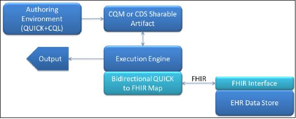
### 4.2 为什么不直接使用FHIR的理由  
临床的数据模型和持久化层因厂商和系统各异.由此而导致无法互联互通.但纵观这些系统,存在着一些共同拥有的部分,FHIR试图
将常见的概念和模式构建成资源,以此为基础来解决互操作性的问题.鉴于此,对于医疗质量的改进而言,形成一个与FHIR紧密融合的
逻辑模型是至关重要的.
但是,出于不同的目的和建模的方法学,QUICK和FHIR模型之间存在着一些显著的差异:
1.  FHIR力图表达的是现如今所有系统存在的概念,而QUICK表达的是对CDS CQM比较重要的那些概念,
即使系统中常常并不存在此类数据(或者说不是结构化数据)

2.  FHIR是一个扁平化模型,没有定义不同概念之间的层级关系,QUICK引入了层级关系,这样就可以编写一些有关父类概念的条件
使得条件的表达力更丰富.(这里是否能举出一例来说明)

3.  FHIR中属性名称随着出现在不同的资源中而不同(属性名称是针对具体资源而言的,是会变的."这点我也认同,大多数属性名称在
资源中都是一致的").QUICK中的属性能够从多个子类中继承得到,保证了一致性("我觉得也未必 只是换了一种说法而已,而且名称太泛泛 也不是很好理解")
比如,FHIR中用药医嘱MedicationPrescription的下医嘱的角色叫*prescriber*,而在检查医嘱DiagnosticOrder中下医嘱的角色叫
 *orderer*, 在QUICK中始终是*orderedBy*.

4.  尽管FHIR和QUICK都是组合式的模型,细节上还是存在一些差异.
 FHIR中的数据结构仅限于局部范围,比如说 ( *MedicationPrescription* 和 *MedicationDispense*中的*Dispense* 是完全不同的). 
 QUICK 中更倾向与数据结构的复用, (只存在单一的 *Dispense* 概念). Moreover,
    the core compositional structure of the QUICK model does not exist
    in FHIR. Where possible, QUICK will preserve the compositional
    flavor of FHIR.

5.  QUICK and FHIR的建模方法学上存在差异.为了避免编辑错误,QUICK不允许使用否定标记和会修改原始语义的扩展. 
QUICK中要表示condition病情/症状没有出现,使用类(*ConditionNonOccurrence*) 而非使用*Condition.status* = ‘refuted’的Condition类

4.3 QUICK的核心结构
---------------------------

QUICK采用的是分级式和组合式两种的组合.也就是说,QUICK中患者的数据(医嘱,手术等)可以是层级式的(Procedure是Act的子类型
,Procedure也会有多种子类型,如影像检查DiagnosticImaging).可以使用这些组件将其组装成更高级的数据元素,如手术医嘱.这种方式
一方面保证了模型元素的复用,另一方面保证了模型间的一致性.(比方说,手术医嘱和用药医嘱拥有一些一样的属性)

QUICK中用于表达患者数据的核心概念是 临床声明(clinical statement),用*ClinicalStatement* 类来表示,. 它能够表示患者健康和诊疗的某些方面的
陈述/声明,每个临床陈述由三个维度组成: *出现/发生occurrence, 主题topic*,
和模式 *modality*,下面的章节对这些进行详细描述. The diagram
below illustrates the core semantic structure of the model.

### 4.3.1 Occurrence

Clinical statements可以分为三类:

1.  A *StatementOfOccurrence* 表示已经存在的事情或者已经发生的事件(已经完成的手术,a proposal
    for a procedure was made).

2.  A *StatementOfNonOccurrence* 表示事件并不存在或者并未发生(患者并没有某种过敏,患者并未服用华法林纳片) 
    non-occurrence是对不存在或未发生的事件的明确声明.

3.  A *StatementOfUnknownOccurrence* 表示不知道陈述是否发生或者没有发生 (例如,不知道父亲是否有糖尿病,不知道患者
是否在过去十年间注射过破伤风疫苗).unknown occurrence是对不知道的事情明确说明. 没有发生和发生了不知道是完全不一
样的
目前的EHR系统大多数只处理已经发生的事情,下的医嘱,完成的操作,所做的观察,存在的病情.对应到statements of occurrence.
 Statements of non-occurrence, 常常出现在症状/病情,诊断的语境下,但EHR系统通常不会采集此类结构化数据. 采集到的结构化Statements of unknown
occurrence (例如 未知的过敏no known allergy) 数据就少之又少.

### 4.3.2 Topic
QUICK中使用*StatementTopic* 类来表示临床陈述的主题,分为两大类: 

1.  有关可观察现象的陈述 *Observable*  (例如患者患有糖尿病,患者血压值为130/84 mm Hg’)

2.  有关临床/医学 *Act*的陈述 (例如,患者使用了某种药物,给患者下了手术医嘱’)

在QUICK中,*Observable*有多个子类,如下图所示 

QUICK中*Act*也有多个子类,如下图所示

### 4.3.3 Modality

Clinical statements都有*modality*. 临床陈述的*modality 模式维度*可以用
*StatementModality* 类i来表示,描述了临床陈述的主题域存在,发生或被体验的方式.*Statement modalities*
分为两大类:
*observation* modality and *action* modalities. 模型中暂时只有一个 observation modality 和5个  action modalities. 
5个action modalities 分别是 *Proposal*, *ProposalAgainst*, *Order*, *Plan*,
and *Performance*.如下图所示

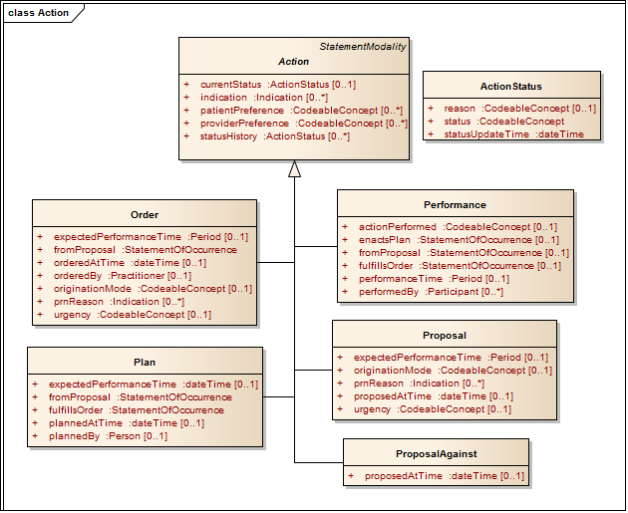

4.4 整合QUICK三个维度的两种方式
--------------------------------------------------

QUICK’的目的在于以结构化的且易于被质量改进知识专家理解的方式表示临床信息,要实现这个目的,核心模型支持两种实现,即采用
不同的方法来整合三个维度 *topic*,*occurrence*, and *modality*. 两种方式分别是:

1.  组合式的方式

2.  多继承的子类父类方式

### 4.4.1 组合式的方式

这种方式下,在 *ClinicalStatement* 类中添加了两个属性: *topic* and *modality*. 
topic属性的值是 *StatementTopic*子类的实例, modality属性的值是 *StatementModality*子类的实例. 
之所以称之为*组合式方式*是因为临床陈述是由这三个维度动态组合而成.比如,a proposal for a
procedure, 可以用 *StatementOfOccurrence* 来表示, topic属性值为 *Procedure* act的实例,  modality属性值为 *Proposal*的实例.

组合式方式中明确地确定了三个维度来表示临床陈述.保持这些类的独立性有助于目清晰地表示模型属性的来源,一些属性来自与
*ClinicalStatement* , 一些来自与
*StatementTopic* , 其他的来自与
*StatementModality* .并不是某个类包含所有可以用来定义临床陈述的所有属性 .

### 4.4.2 多继承leaf-level方式

从组合式的角度来看,不同的概念和相关的概念之间存在很明确的区分,但是在构建知识规则时可能不是那么好用,
因为这种方式不利用以简单的对象-属性对的方式来获取信息.比如,影像检查的
*procedureMethod* of an imaging procedure would be addressed through a
lengthy path expression, *StatementOfOccurrence.topic.procedureMethod*.
Further complicating matters, the fact that *procedureMethod* even
exists as an attribute of the clinical statement instance can only be
determined by introspecting the contents of the
*StatementOfOccurrence.topic* (in this case, an instance of the class
*DiagnosticImaging*). The same is true for the attributes of
*StatementOfOccurrence.modality*.

这些复杂度促生了"leaf-level概念"的方式,这种方式下, (*ClinicalStatement*, *StatementTopic*, and *Modality*) 三种层次通过多种
继承来形成子类-父类,所有相关的属性都处于同一层次.这些是预设好的类,拥有固定的属性和唯一的类名称,唯一的缺点在于预设类的
数目是combinatorial,涉及到构造三种occurrence类型的topics and modalities.下表展示了主题和模式的组合有那些,实际上并不需要这么多,
其中一些不可能会发生 
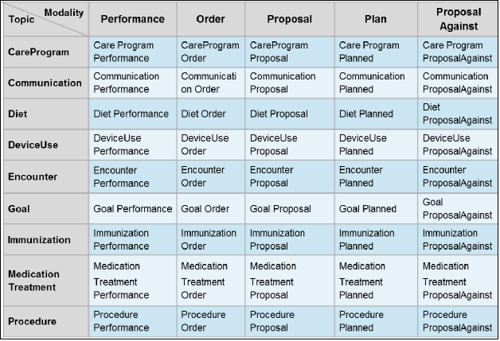

最终的 leaf-level 类名可以通过{topic} + {modality} + {occurrence}的方式得到，例如, *ProcedureProposalOccurrence*. 
我们考虑会使用一些更友好的名称来替代这些名称。 *Prescription* 而不是
*MedicationTreatmentOrderOccurrence.* 另外，我们可以他欧冠那个默认值来简化名称，比如，利用
*ProcedureProposal* 来表示*ProcedureProposalOccurrence*, 鉴于occurrence比non-occurrence 或 unknown
occurrence更常见. 

QUICK模型中采用了多种面向对象语言中所采用的 mixin 的方式来 表示QUICK leaf-level 概念.[^5]
比如， *ProcedureProposalOccurrence* 概念可以定义成从*StatementOfOccurrence*衍生得到的leaf-level的概念 ，通过继承和混合
 *Proposal* and *Procedure*二者的属性,如下图所示：

诸如Java and C\# 等编程语言中既不支持多重继承和mixin的，可以通过单一继承和接口轻松实现同样的结果

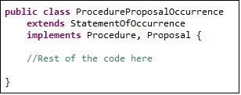

具体的leaf-level类(预设类)不仅仅使得知识管理更加 直观，在规则引擎中也比组合是结构更加可控。最重要的是，大多数编程语言都支持
组合式和 leaf-leve的方式.

4.5 在临床表达式中使用QUICK模型
---------------------------------------

 QUICK 模型的目的是要在诸如CQL等临床表达式语言中使用。 这里简要介绍如何在CQL使用QUICK模型。
要了解更多CQL语言相关信息，请参考Clinical Quality Language Specification,R1.

CQL中获取/检索,查询( *retrieve* and *query* )的construct是用于访问知识制品(knowledge artifact)中的医学信息(度量指标或规则) 
检索结果常常是某种类型的医学数据的列表。查询能够对检索结果进一步过滤，shape和扩展以实现知识制品中任意的医学逻辑的表达。
能够检索的数据类型是由ClinicalStatement的维度所规定的，如下所示：

[Occurrence of Encounter, Performance]

这个例子中指的是检索某个病人所有的*EncounterPerformanceOccurrence*.主题是 *Encounter* ,模式是 *Performance*.
当值为*Occurrence*时，occurrence维度的默认值是*Occurrence*，无需出现。

[Encounter, Performance]

对于 observables,只有一种模式modality，因此也不是必须存在的，要检索患者的所有症状/病情 只需要[Condition]

只有是 未出现和不知道是否出现non-occurrence and unknown-occurrence的情况下，才需要occurrence维度，例如,
[NonOccurrence of Condition]
[UnknownOccurrence of Condition]

检索时也可以附带一个过滤条件，比如说匹配某个值集/字典的[^6]:

[Condition: “Acute Pharyngitis”]

上面的例子中，“Acute Pharyngitis/急性咽炎”隐式地指的是*Condition.code*的值, 在QUICK模型中，*Condition.code*是*Condition*类
主编码属性。(暂时QUICK模型中并没有对主primary code for topics作出正式定义l). 如果要对非主编码属性进行过滤，可以在检索
表达式中指定相关的属性名称：

[Condition: severity in "Acute Severity"]

查询的话可以进一步进行过滤，如

[Condition: severity in "Acute Severity"] where effectiveTime overlaps MeasurementPeriod

在CQL标准和QUICK模型的leaf陈述的文档中，可以查看更多查询和检索的实例。

为了要执行这些检索，系统必须将QUICK对象和属性与EHR数据的查询一一对应，如 [*Section
4.1*](#how-quick-is-used-in-quality-improvement)所说的那样, FHIR可以作为CQL解释器和EHR数据仓库
之间传递数据的中间介质 。如果这样的话，执行引擎能够将CQL检索条件转换成FHIR的增删改查操作.

检索得到结果之后, CQL中还有很多操作,能够让我们根据数据之间的关系和性质进一步过滤和处理数据, 其中包括了
时间操作,算术操作,逻辑,文本,列表操作等. 制品编辑人员Artifact authors可以利用这些操作来筛选满足特定条件的总体

得到检索结果之后要执行其他的CQL表达式的话,需要将从数据源获取的医学数据转换成QUICK模型的类和属性.既可以在
实现系统中直接完成,又可以利用FHIR作为中间介质.比如,CQL表达式中包含了QUICK属性*Condition.ageAtOnset*, 比方说,
*Condition.ageAtOnset \< 18 years*.如果使用FHIR的话,病发日期[^7] 的值要么是*Condition.onsetDate* 字段,要么是
*Condition.onsetAge*. 如果是Date的话,需要把日期转换成年龄.为了简化映射过程,QUICK中直接采用了FHIR的数据类型

4.6 扩展和规范
---------------------------

开发人员可以对QUICK进行扩展来满足他们的需求. 扩展机制仍处于研发阶段,预计下一个版本中会纳入进来.
扩展机制最重要的设计目的在于不宜增加表达的复杂度.我们期望利用FHIR的扩展机制,这样数据传输层会相对简单一些,而且与CQL
如何将FHIR资源转换成QUICK类之间兼容.

同样,QUICK中也需要构建一些profile规范.这些规范中会对QUICK模型的元素进行一些额外的约束以满足特定的目的,比如,
表示转诊申请时对 Encounter的属性进行约束,目前,QUICK模型中包含了profile identifiers.但如何构建profile的机制尚不存在.
 这部分工作也希望能够借鉴FHIR的一些经验.

4.7 与FHIR之间映射的例子
---------------------------

大多数情况下,QUICK和FHIR中类的名称,数据类型,属性的基数都是一样的.下表展示了FHIR *Condition* 资源与QUICK 
*ConditionOccurrence* 类的对应关系.

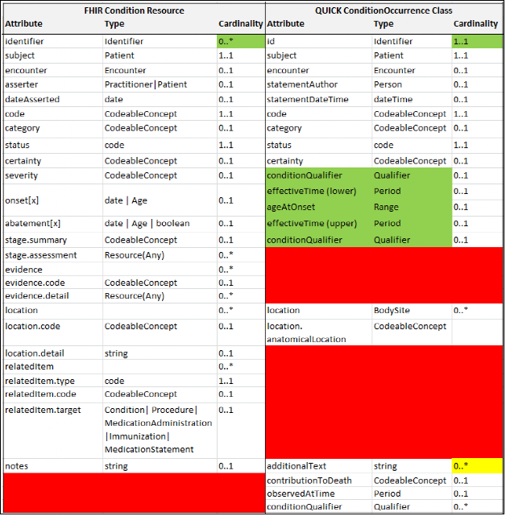

QUICK中一些概念是从高层次的概念中继承下来的,导致概念的名称会更加通用,诸如 *statementDateTime*继承自*ClinicalStatement*, 
对应到 *Condition.dateAsserted*字段. 这里面又有一些小差异,比方 *Condition.onset*字段的数据类型可以是date 和 Age,
但在QUICK中对应两个字段, *effectiveTime* 的数据类型是Period,而 *ageAtOnset* 是Range.同样的, *Condition.abatement*
字段在QUICK中是*effectiveDate*用end date来表示的.FHIR资源中的一些字段定义的不够清晰,不知道该怎么对应,比如
*Encounter.period* 和*Encounter.hospitalization.period* 字段,, 我们可以将其看成是冗余的. 一些不一致的地方
 FHIR和QUICK团队正在解决当中.

5 供知识编辑人员使用的参考资料
==================================

5.1 HTML格式
--------------

QUICK中提供了自动生成的HTML格式的技术文档,其中罗列了leaf-level概念的所有属性,基数,数据类型和定义. 在页面左侧的Statement
包中点击即可查看这些leaf-level类. 

#### 

5.2 QUICK的EA模型结构(UML模型)(QUICK.eap)
--------------------------------------------------------------

UML的QUICK模型:

1.  [*http://www.ibm.com/developerworks/rational/library/content/RationalEdge/sep04/bell/*](http://www.ibm.com/developerworks/rational/library/content/RationalEdge/sep04/bell/)

2.  [*http://www.sparxsystems.com/resources/uml2\_tutorial/uml2\_classdiagram.html*](http://www.sparxsystems.com/resources/uml2_tutorial/uml2_classdiagram.html)

The second reference, by the developers of Enterprise Architect, uses
the exact notation for diagrams as QUICK.

QUICK的类组织成6大顶层包:  ***action***,***common***, ***core***, ***datatypes***, ***observable,*** 和
***statements***. 

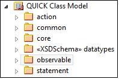

### 5.2.1 Core Package

 ***core*** 包中涵盖了逻辑模型的核心类-顾名思义,三大clinical statement和基类*ClinicalStatement*,*StatementModality*
 *StatementTopic* 类.

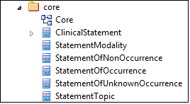

### 5.2.2 Common Package

***common***包涵盖了其他包的共用类 (e.g., act和observable可能都引用了*BodySite* ).
比如*Patient*, *Practitioner*, *Medication*, *Facility* 等实体类. .

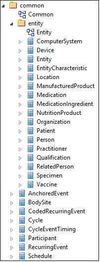

### 5.2.3 Action Package

***action***包涵盖了与临床行为/动作相关的类,比如 acts and action modalities (in the ***act*** and
***modality*** subpackages) 和 ***common*** concepts referenced by
action classes (e.g., *Dosage*, *Dispense*, and *VaccinationProtocol*):

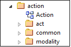

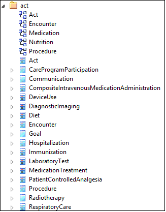

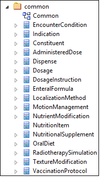

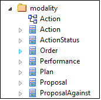

### 5.2.4 Datatypes Package

***datatypes***包涵盖了逻辑模型中使用到的所有FHIR数据类型.详细信息请查阅[FHIR官方文档](http://hl7.org/implement/standards/fhir/datatypes.html)

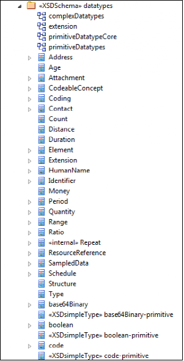

### 5.2.5 Observable Package

 ***observable***包涵盖了表示可观察概念的陈述.诸如 *Condition* and *ObservationResult.*
 同时也包含了 observation modality concept.

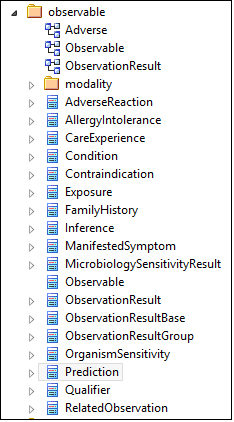

### 5.2.6 Statement Package

***statement***包含了基本的 package contains an initial set of the model’s
leaf-level components. Currently, this package contains the set of
resources identified as high-priority for our initial pilot projects and
does not represent the comprehensive set of leaf-level concepts that can
be represented by QUICK.

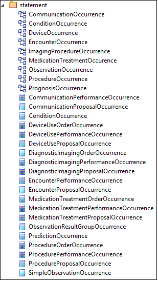

[^1]: By deterministic, we mean whether a consistent mapping exists
    between a class or an attribute in both the QUICK and FHIR models.

[^2]: A fact model structures domain knowledge about core concepts and
    relationship at the most atomic level of business knowledge. It
    provides the fundamental building blocks for defining or deriving
    more advanced forms of knowledge, such as rules and inferred
    knowledge. An interesting distinction between a fact model and a
    data model is made [*here*](www.brcommunity.com/b008a.php).

[^3]: Should QUICK expand the scope of the model beyond the patient? Is
    such an expansion necessary for the representation of clinical
    quality measures?

[^4]: This statement is based on the assumption that the way clinical
    data is currently persisted may not be optimal for computation in
    quality improvement. For instance, persisting unstructured clinical
    data may require the use of parsers before the information is useful
    to a rules engine.

[^5]: For more information about mixins, please read this
    [*article*](http://en.wikipedia.org/wiki/Mixin).

[^6]: See the CQL specification for details on how to create value set
    references.

[^7]: A FHIR profile can be used to force the onset to be returned as an
    age, but there are pros and cons to forcing this conversion on the
    server side, and the extent to which FHIR profiles will be used to
    shape the data exchange has not been decided.

