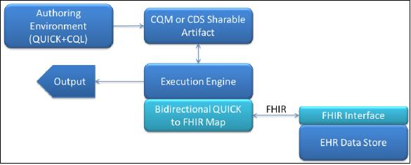
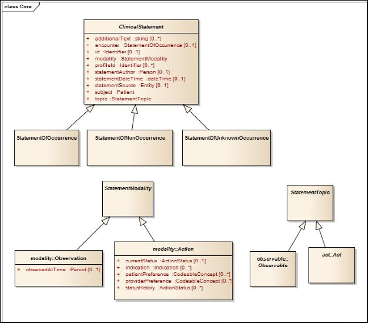
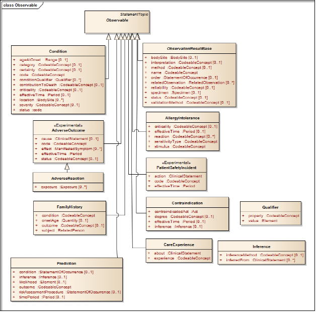
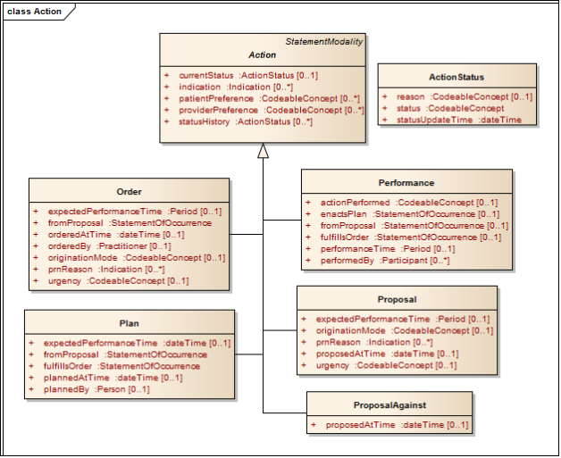
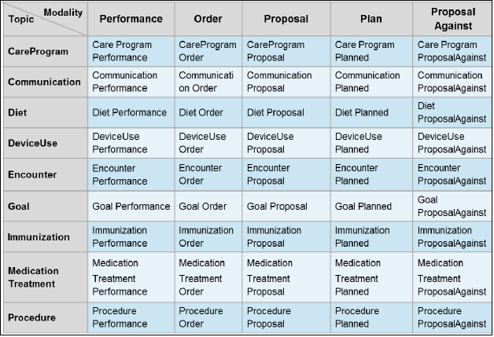
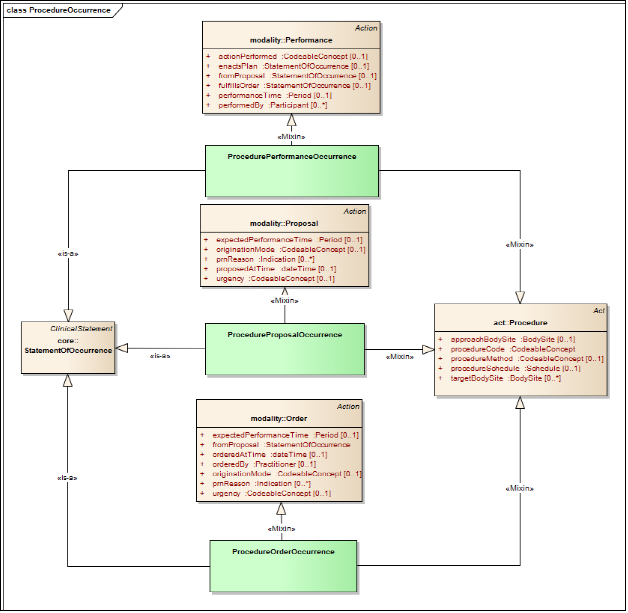
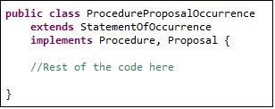

HL7 Logical Model: Quality Improvement and Clinical Knowledge (QUICK), Release 1 - US Realm September 2014
文件名:QUICK-Overview
可以将其视为背景介绍性文件,可以帮助我们进一步了解QUCIK模型.
---------------------------------------
目录
* 1 目标
* 2 投票版材料
* 3 需要重点关注的点
* 4 QUICK模型概述
    * 4.1 在医疗质量改进中如何使用QUICK模型
    * 4.2 为什么不直接使用FHIR的理由 
    * 4.3  QUICK的核心结构
        * 4.3.1 Occurrence 
        * 4.3.2 Topic 
        * 4.3.3 Modality
    * 4.4 整合QUICK三个维度的两种方法学
        * 4.4.1 组合式的方法
        * 4.4.2 多重继承的"叶子"方法
    * 4.5 在临床表达式中使用QUICK模型
    * 4.6 扩展和规范
    * 4.7 与FHIR映射的实例
* 5 供知识编辑人员使用的参考资料
    * 5.1 HTML页面
    * 5.2 QUICK的EA模型结构
        * 5.2.1 Core包
        * 5.2.2 Common包
        * 5.2.3 Action包
        * 5.2.4 Datatypes包
        * 5.2.5 Observable包
        * 5.2.6 Statement包

## 1 目标
由于QUICK逻辑模型仍处于开发阶段,并不是所有概念都已经定义好了,请重点关注核心框架和下述概念

-   CommunicationPerformanceOccurrence

-   CommunicationProposalOccurrence

-   ConditionOccurrence

-   DeviceUseOrderOccurrence

-   DeviceUsePerformanceOccurrence

-   DeviceUseProposalOccurrence

-   DiagnosticImagingOrderOccurrence

-   DiagnosticImagingPerformanceOccurrence

-   DiagnosticImagingProposalOccurrence

-   EncounterPerformanceOccurrence

-   EncounterProposalOccurrence

-   MedicationTreatmentOrderOccurrence

-   MedicationTreatmentPerformanceOccurrence

-   MedicationTreatmentProposalOccurrence

-   ObservationResultGroupOccurrence

-   PredictionOccurrence

-   ProcedureOrderOccurrence

-   ProcedurePerformanceOccurrence

-   ProcedureProposalOccurrence

-   SimpleObservationOccurrence

-   Communications (e.g., an alert, notification, reminder, or other
    message)

-   Conditions

-   Clinical findings and observations (e.g., SimpleObservation and
    ResultGroup)

-   Encounters

-   Device usage

-   Medication-related concepts, such as the administration or
    dispensing of a medication

-   Procedures (in general)

-   Imaging procedures

-   Prediction (e.g., Prognoses)
## 2 投票版相关材料
* QUICK的EA模型
* QUICK标准文件,罗列了类,属性和类图
* API接口文档 HTML格式,与一般的JAVA API文档类似 
* 这份文档
## 3 关注点
投票阶段,希望能够得到来自社区的对下面几点的反馈,
* 1 . QUICK模型的建模方法
    -  1.1 模型的结构是否完善
    -  1.2 核心的类,关系,子类(clinical statement statement topic modality)是否完善
    -  1.3 你对于组合式vs继承式表达的态度
* 2 . 概念的覆盖范围和表达能力  
    -  2.1 类的定义是否实际,你的EHR系统中是否有QUICK模型中类和属性相关数据
    -  2.2 模型是否涵盖了QDM和VMR中的概念,是否存在不足
    -  2.3  QUICK中的类或概念是否太多
    -  类中包含的属性是否在CDS CQM中够用
* 3 . 模型的可用性
    -  3.1  模型是否适合编写临床表达式
    -  3.2  模型是否可以用作CDS制品(医嘱套餐,文档模板,规则),
    -  3.3  模型是否可以用来治理指标的实现/执行
* 4 . 与其他HL7标准整合的能力 如FHIR 
    -  4.1  QUICK模型是否能够与FHIR进行映射
    -  4.2  QUICK和FHIR可以整合成一个模型吗?
    -  4.3  目前 FHIR与QUICK中类的表达方式各异
    -  4.4  QUICK是否可以作为Arden的临床模型
* 5 .  实现和应用的难度
    - 5.1  对于知识的编辑人员,模型是否直观,类的定义是否明确,概念中的属性层次是否准确
    - 5.2  每个类,子类的目的是否明确,什么时候使用等
    - 5.3  模型是否增加了实现的复杂程度 
    - 5.4   对于当下的规则引擎而言,QUICK是否易于实现,
* 6 . 其他
    - 6.1   模板化和详细的临床模型
    - 6.2   扩展机制
    - 6.3   术语绑定
## 4 QUICK模型概述
QUICK模型就是用来表示在临床决策支持和医疗质量测度中涉及到的患者相关临床概念的逻辑模型.
旨在打造这么一个CDS和CQM领域统一的临床模型.现有的CIS系统中的数据格式常常不支持质量改进计算方面的需求
也就是数据不完全是结构化和编码,进一步阻碍了形成易于理解的表达式和条件来做一些质量相关的推理工作.
QUICK逻辑模型是基于QIDAM R1中的概念模型,QIDAM R1在2014年5月通过了HL7的投票,其中描述了质量改进的数据模型的应用场景和需求
QUICK模型中将QIDAM中定义的抽象数据类型替换成FHIR中的数据类型,增加了identifier的新属性,规定了基数,包含了一些子概念

### 4.1  在医疗质量改进中如何使用QUICK模型
QUICK的类和属性提供了一种表达ＥＨＲ系统中信息的标准化方式．通过使用CQL语言和QUICK模型，ａｒｔｉｆａｃｔ　ａｕｔｈｏｒ就可以构建出
标准化的可移植的质量测度和临床决策支持规则．
如果需要执行这些规则和指标，需要将QUICK映射到具体的EHR数据上去．可以分为２种，一种是直接将ＱＵＩＣＫ映射到我们自己的ｓｃｈｅｍａ上，一种是以ＦＨＩＲ为中间产物．如果EHR提供FHIR接口的话，采用是第二种，这时候，QUICK的类和属性都可以双向映射到ＦＨＩＲ资源中去
CQL中涉及到获取QUICK类和属性的数据时，就可以将其转换成FHIR的读取，查询操作，然后在执行规则时通过FHIR的restful 接口获取EHR数据.
,处理引擎获取到的数据是 FHIR bundle,这时候并不是直接处理XML/JSON,而是将FHIR数据转换成QUICK对象供后续的CQL命令处理
QUICK与FHIR的数据转换是CQL解释器的后台功能.
鉴于目前的关注点是QUICK本身,并非在于知识的构建和解释,这些操作不做过多说明.如图

### 4.2 为什么不直接使用FHIR的理由  
临床的数据模型和持久化层因厂商和系统各异.由此而导致无法互联互通.但纵观这些系统,存在着一些共同拥有的部分,FHIR试图
将常见的概念和模式构建成资源,以此为基础来解决互操作性的问题.鉴于此,对于医疗质量的改进而言,形成一个与FHIR紧密融合的
逻辑模型是至关重要的.
但是,出于不同的目的和建模的方法学,QUICK和FHIR模型之间存在着一些显著的差异:
1.  FHIR力图表达的是现如今所有系统存在的概念,而QUICK表达的是对CDS CQM比较重要的那些概念,
即使系统中常常并不存在此类数据(或者说不是结构化数据)

2.  FHIR是一个扁平化模型,没有定义不同概念之间的层级关系,QUICK引入了层级关系,这样就可以编写一些有关父类概念的条件
使得条件的表达力更丰富.(这里是否能举出一例来说明)

3.  FHIR中属性名称随着出现在不同的资源中而不同(属性名称是针对具体资源而言的,是会变的."这点我也认同,大多数属性名称在
资源中都是一致的").QUICK中的属性能够从多个子类中继承得到,保证了一致性("我觉得也未必 只是换了一种说法而已,而且名称太泛泛 也不是很好理解")
比如,FHIR中用药医嘱MedicationPrescription的下医嘱的角色叫*prescriber*,而在检查医嘱DiagnosticOrder中下医嘱的角色叫
 *orderer*, 在QUICK中始终是*orderedBy*.

4.  尽管FHIR和QUICK都是组合式的模型,细节上还是存在一些差异.
 FHIR中的数据结构仅限于局部范围,比如说 ( *MedicationPrescription* 和 *MedicationDispense*中的*Dispense* 是完全不同的). 
 QUICK 中更倾向与数据结构的复用, (只存在单一的 *Dispense* 概念). Moreover,
    the core compositional structure of the QUICK model does not exist
    in FHIR. Where possible, QUICK will preserve the compositional
    flavor of FHIR.

5.  QUICK and FHIR的建模方法学上存在差异.为了避免编辑错误,QUICK不允许使用否定标记和会修改原始语义的扩展. 
QUICK中要表示condition病情/症状没有出现,使用类(*ConditionNonOccurrence*) 而非使用*Condition.status* = ‘refuted’的Condition类

4.3 QUICK的核心结构
---------------------------

QUICK采用的是分级式和组合式两种的组合.也就是说,QUICK中患者的数据(医嘱,手术等)可以是层级式的(Procedure是Act的子类型
,Procedure也会有多种子类型,如影像检查DiagnosticImaging).可以使用这些组件将其组装成更高级的数据元素,如手术医嘱.这种方式
一方面保证了模型元素的复用,另一方面保证了模型间的一致性.(比方说,手术医嘱和用药医嘱拥有一些一样的属性)

QUICK中用于表达患者数据的核心概念是 临床声明(clinical statement),用*ClinicalStatement* 类来表示,. 它能够表示患者健康和诊疗的某些方面的
陈述/声明,每个临床陈述由三个维度组成: *出现/发生occurrence, 主题topic*,
和模式 *modality*,下面的章节对这些进行详细描述. The diagram
below illustrates the core semantic structure of the model.

### 4.3.1 Occurrence

Clinical statements可以分为三类:

1.  A *StatementOfOccurrence* 表示已经存在的事情或者已经发生的事件(已经完成的手术,a proposal
    for a procedure was made).

2.  A *StatementOfNonOccurrence* 表示事件并不存在或者并未发生(患者并没有某种过敏,患者并未服用华法林纳片) 
    non-occurrence是对不存在或未发生的事件的明确声明.

3.  A *StatementOfUnknownOccurrence* 表示不知道陈述是否发生或者没有发生 (例如,不知道父亲是否有糖尿病,不知道患者
是否在过去十年间注射过破伤风疫苗).unknown occurrence是对不知道的事情明确说明. 没有发生和发生了不知道是完全不一
样的
目前的EHR系统大多数只处理已经发生的事情,下的医嘱,完成的操作,所做的观察,存在的病情.对应到statements of occurrence.
 Statements of non-occurrence, 常常出现在症状/病情,诊断的语境下,但EHR系统通常不会采集此类结构化数据. 采集到的结构化Statements of unknown
occurrence (例如 未知的过敏no known allergy) 数据就少之又少.

### 4.3.2 Topic
QUICK中使用*StatementTopic* 类来表示临床陈述的主题,分为两大类: 

1.  有关可观察现象的陈述 *Observable*  (例如患者患有糖尿病,患者血压值为130/84 mm Hg’)

2.  有关临床/医学 *Act*的陈述 (例如,患者使用了某种药物,给患者下了手术医嘱’)

在QUICK中,*Observable*有多个子类,如下图所示 

QUICK中*Act*也有多个子类,如下图所示

### 4.3.3 Modality

Clinical statements都有*modality*. 临床陈述的*modality 模式维度*可以用
*StatementModality* 类i来表示,描述了临床陈述的主题域存在,发生或被体验的方式.*Statement modalities*
分为两大类:
*observation* modality and *action* modalities. 模型中暂时只有一个 observation modality 和5个  action modalities. 
5个action modalities 分别是 *Proposal*, *ProposalAgainst*, *Order*, *Plan*,
and *Performance*.如下图所示

4.4 整合QUICK三个维度的两种方式
--------------------------------------------------

QUICK’的目的在于以结构化的且易于被质量改进知识专家理解的方式表示临床信息,要实现这个目的,核心模型支持两种实现,即采用
不同的方法来整合三个维度 *topic*,*occurrence*, and *modality*. 两种方式分别是:

1.  组合式的方式

2.  多继承的子类父类方式

### 4.4.1 组合式的方式

这种方式下,在 *ClinicalStatement* 类中添加了两个属性: *topic* and *modality*. 
topic属性的值是 *StatementTopic*子类的实例, modality属性的值是 *StatementModality*子类的实例. 
之所以称之为*组合式方式*是因为临床陈述是由这三个维度动态组合而成.比如,a proposal for a
procedure, 可以用 *StatementOfOccurrence* 来表示, topic属性值为 *Procedure* act的实例,  modality属性值为 *Proposal*的实例.

组合式方式中明确地确定了三个维度来表示临床陈述.保持这些类的独立性有助于目清晰地表示模型属性的来源,一些属性来自与
*ClinicalStatement* , 一些来自与
*StatementTopic* , 其他的来自与
*StatementModality* .并不是某个类包含所有可以用来定义临床陈述的所有属性 .

### 4.4.2 多继承leaf-level方式

从组合式的角度来看,不同的概念和相关的概念之间存在很明确的区分,但是在构建知识规则时可能不是那么好用,
因为这种方式不利用以简单的对象-属性对的方式来获取信息.比如,影像检查的
*procedureMethod* of an imaging procedure would be addressed through a
lengthy path expression, *StatementOfOccurrence.topic.procedureMethod*.
Further complicating matters, the fact that *procedureMethod* even
exists as an attribute of the clinical statement instance can only be
determined by introspecting the contents of the
*StatementOfOccurrence.topic* (in this case, an instance of the class
*DiagnosticImaging*). The same is true for the attributes of
*StatementOfOccurrence.modality*.

这些复杂度促生了"leaf-level概念"的方式,这种方式下, (*ClinicalStatement*, *StatementTopic*, and *Modality*) 三种层次通过多种
继承来形成子类-父类,所有相关的属性都处于同一层次.这些是预设好的类,拥有固定的属性和唯一的类名称,唯一的缺点在于预设类的
数目是combinatorial,涉及到构造三种occurrence类型的topics and modalities.下表展示了主题和模式的组合有那些,实际上并不需要这么多,
其中一些不可能会发生 

最终的 leaf-level 类名可以通过{topic} + {modality} + {occurrence}的方式得到，例如, *ProcedureProposalOccurrence*. 
我们考虑会使用一些更友好的名称来替代这些名称。 *Prescription* 而不是
*MedicationTreatmentOrderOccurrence.* 另外，我们可以他欧冠那个默认值来简化名称，比如，利用
*ProcedureProposal* 来表示*ProcedureProposalOccurrence*, 鉴于occurrence比non-occurrence 或 unknown
occurrence更常见. 

QUICK模型中采用了多种面向对象语言中所采用的 mixin 的方式来 表示QUICK leaf-level 概念.[^5]
比如， *ProcedureProposalOccurrence* 概念可以定义成从*StatementOfOccurrence*衍生得到的leaf-level的概念 ，通过继承和混合
 *Proposal* and *Procedure*二者的属性,如下图所示：

诸如Java and C\# 等编程语言中既不支持多重继承和mixin的，可以通过单一继承和接口轻松实现同样的结果

具体的leaf-level类(预设类)不仅仅使得知识管理更加 直观，在规则引擎中也比组合是结构更加可控。最重要的是，大多数编程语言都支持
组合式和 leaf-leve的方式.

4.5 在临床表达式中使用QUICK模型
---------------------------------------

 QUICK 模型的目的是要在诸如CQL等临床表达式语言中使用。 这里简要介绍如何在CQL使用QUICK模型。
要了解更多CQL语言相关信息，请参考Clinical Quality Language Specification,
R1.

The *retrieve* and *query* constructs within CQL are used for accessing
clinical information in a knowledge artifact such as a measure or rule.
The result of a retrieve is always a list of some type of clinical data.
Queries enable results of retrieves to be further filtered, shaped, and
extended to enable the expression of arbitrary clinical logic that can
be used in knowledge artifacts. The type of data to be retrieved are
specified by the axes of the ClinicalStatement as follows:

[Occurrence of Encounter, Performance]

This example retrieves all *EncounterPerformanceOccurrence* statements
for a patient. *Encounter* is the topic, *Performance* is the modality.
The occurrence axis does not need to be specified when the value is
*Occurrence*; this is the default value.

[Encounter, Performance]

For observables, modality is not required, since there is only one
modality for observations. Thus, all Conditions for patients can be
retrieved by

[Condition]

The occurrence axis is required only for the non-occurrence and
unknown-occurrence cases, for example:

[NonOccurrence of Condition]

[UnknownOccurrence of Condition]

A retrieve can be combined with a filter limiting the retrieve by
matching on a specified value set[^6]:

[Condition: “Acute Pharyngitis”]

In this example, the value set “Acute Pharyngitis” refers implicitly to
*Condition.code*, which is the primary coded attribute of the class
*Condition* designated by the QUICK model (these designations of primary
code for topics are not yet in the current QUICK model). To support the
use of filtering on code-valued attributes that may not be the primary
code attribute, the retrieve expression allows the attribute name to be
specified:

[Condition: severity in "Acute Severity"]

Queries allow further filtering such as

[Condition: severity in "Acute Severity"] where effectiveTime overlaps
MeasurementPeriod

For more examples of query and retrieve statements, including date range
filtering, see the CQL Specification and the documentation of the leaf
statements in the QUICK model and specification.

To execute retrieves, the implementing system must map QUICK objects and
properties to queries against EHR data. As discussed in [*Section
4.1*](#how-quick-is-used-in-quality-improvement), FHIR can be used as an
intermediate representation to pass data between the CQL interpreter and
the EHR data store. If so, the execution engine would translate the CQL
retrieve statement into a FHIR read, search, or query.

After data is retrieved, CQL has many operations that allow the user to
further filter and process the objects that are retrieved based on their
relationships and properties. These operations include timing operators,
mathematical, logical, text and list operations, and many more. Artifact
authors use these operators to shape patient populations meeting the
desired criteria.

To execute the CQL statements that follow retrieves, clinical data
received from the data source must be mapped into the QUICK model
classes and properties. This can be done directly by the implementing
system, or via a standard FHIR mapping, if FHIR is used as intermediary.
For example, CQL expressions can include the QUICK property
*Condition.ageAtOnset*, for example, *Condition.ageAtOnset \< 18 years*.
If FHIR is used as an intermediate representation (as discussed above),
condition onset can be returned[^7] either as *Condition.onsetDate* or
*Condition.onsetAge*. If the former, conversion from date to age is
required to enable evaluation of the expression. To make this mapping
easier, the data types in QUICK are taken directly from FHIR.

4.6 Extensions and Profiles
---------------------------

There is a requirement that QUICK can be extended by its implementers,
to support needs that either are generally useful but not met by QUICK
at that time, or needs that might be proprietary. The mechanisms for
extension are still being developed and will be included in a future
version of the specification. An important design objective is that the
extension mechanism should not add complexity in the expressions using
the extended classes and attributes. We expect to build upon FHIR’s
extension approach so that implementation of the physical layer (i.e.,
patient data transport) is easier and is compatible with how CQL
transforms FHIR resources into QUICK classes.

There also is a need to create profiles within QUICK. These profiles
will allow specification of constraints on various elements in QUICK for
specific purposes - e.g., the constraints on attributes for Encounter
when describing a referral request. Currently, the QUICK model includes
the profile identifiers. However, mechanisms for specifying profiles are
not developed. Here too, we expect to leverage work done by FHIR.

4.7 Example Mapping to FHIR
---------------------------

In most cases, the corresponding classes in QUICK and FHIR have the same
name, type, and cardinality for their attributes. As an example, the
following table defines the mapping between FHIR *Condition* resource
and the QUICK *ConditionOccurrence* class.

Some concepts in QUICK are inherited from higher-level concepts so the
names are more generic in nature; e.g., *statementDateTime*, inherited
from *ClinicalStatement*, which maps to the *Condition.dateAsserted*
field. There are also some subtle differences in QUICK to make for
simpler expressions and implementations, for example, *Condition.onset*
property takes on a union of date and Age types, but this is simplified
in QUICK with explicit *effectiveTime* and *ageAtOnset* fields of type
Period and Range, respectively. Likewise, the *Condition.abatement*
field is represented by the end date in the QUICK *effectiveDate*
period. FHIR resources occasionally have fields that are not clearly
defined enough to map, such as the *Encounter.period* and
*Encounter.hospitalization.period* fields, which at first glance may be
redundant. In such cases, the QUICK and FHIR teams work together to
align the two together. A number of issues have been submitted to the
HL7 FHIR issue tracking system to be resolved.

5 References for Knowledge Authors
==================================

5.1 HTML Pages
--------------

QUICK provides with technical documentation in auto-generated
(JavaDoc-style) HTML format pages. These pages list all attributes
inherited by a leaf-level concept and their cardinalities, types, and
definitions. The leaf-level classes are accessed by clicking on the
Statement package link on the left of the page. This information can be
viewed grouped by the parent concept that contributed them or as a
simple, alphabetically ordered list of all attributes with parent
attribution referenced as hyperlinks.

#### 

5.2 The QUICK Enterprise Architect Model Structure (QUICK.eap)
--------------------------------------------------------------

The QUICK model is specified in the form of a Unified Modeling Language
class diagram. For readers not familiar with this modeling approach,
these references provide an introduction:

1.  [*http://www.ibm.com/developerworks/rational/library/content/RationalEdge/sep04/bell/*](http://www.ibm.com/developerworks/rational/library/content/RationalEdge/sep04/bell/)

2.  [*http://www.sparxsystems.com/resources/uml2\_tutorial/uml2\_classdiagram.html*](http://www.sparxsystems.com/resources/uml2_tutorial/uml2_classdiagram.html)

The second reference, by the developers of Enterprise Architect, uses
the exact notation for diagrams as QUICK.

QUICK classes are organized into six top-level packages: ***action***,
***common***, ***core***, ***datatypes***, ***observable,*** and
***statements***, as illustrated below. These packages are described in
the subsections of this section.

### 5.2.1 Core Package

The ***core*** package contains the core classes of the logical
model—namely, the three clinical statements as well as the base
*ClinicalStatement* class, the *StatementModality* abstract class, and
the *StatementTopic* abstract class:

### 5.2.2 Common Package

The ***common*** package contains classes shared across several other
packages (e.g., *BodySite* may be referenced by acts and observables).
Of these, entities such as *Patient*, *Practitioner*, *Medication*, and
*Facility* represent an important subcategory of common classes. This
subcategory of common classes is located in the entity package.

### 5.2.3 Action Package

The ***action*** package contains concepts relevant to clinical actions
such as the acts and action modalities (in the ***act*** and
***modality*** subpackages) and ***common*** concepts referenced by
action classes (e.g., *Dosage*, *Dispense*, and *VaccinationProtocol*):

### 5.2.4 Datatypes Package

The ***datatypes*** package contains the full set of FHIR datatypes
referenced in this logical model. Detailed documentation for the
datatypes can be found on the FHIR web-site:
http://hl7.org/implement/standards/fhir/datatypes.html

### 5.2.5 Observable Package

The ***observable*** package contains statement topics that represent
observable concepts such as *Condition* and *ObservationResult.* It also
contains the observation modality concept.

### 5.2.6 Statement Package

The ***statement*** package contains an initial set of the model’s
leaf-level components. Currently, this package contains the set of
resources identified as high-priority for our initial pilot projects and
does not represent the comprehensive set of leaf-level concepts that can
be represented by QUICK.

[^1]: By deterministic, we mean whether a consistent mapping exists
    between a class or an attribute in both the QUICK and FHIR models.

[^2]: A fact model structures domain knowledge about core concepts and
    relationship at the most atomic level of business knowledge. It
    provides the fundamental building blocks for defining or deriving
    more advanced forms of knowledge, such as rules and inferred
    knowledge. An interesting distinction between a fact model and a
    data model is made [*here*](numbering.xml).

[^3]: Should QUICK expand the scope of the model beyond the patient? Is
    such an expansion necessary for the representation of clinical
    quality measures?

[^4]: This statement is based on the assumption that the way clinical
    data is currently persisted may not be optimal for computation in
    quality improvement. For instance, persisting unstructured clinical
    data may require the use of parsers before the information is useful
    to a rules engine.

[^5]: For more information about mixins, please read this
    [*article*](styles.xml).

[^6]: See the CQL specification for details on how to create value set
    references.

[^7]: A FHIR profile can be used to force the onset to be returned as an
    age, but there are pros and cons to forcing this conversion on the
    server side, and the extent to which FHIR profiles will be used to
    shape the data exchange has not been decided.

